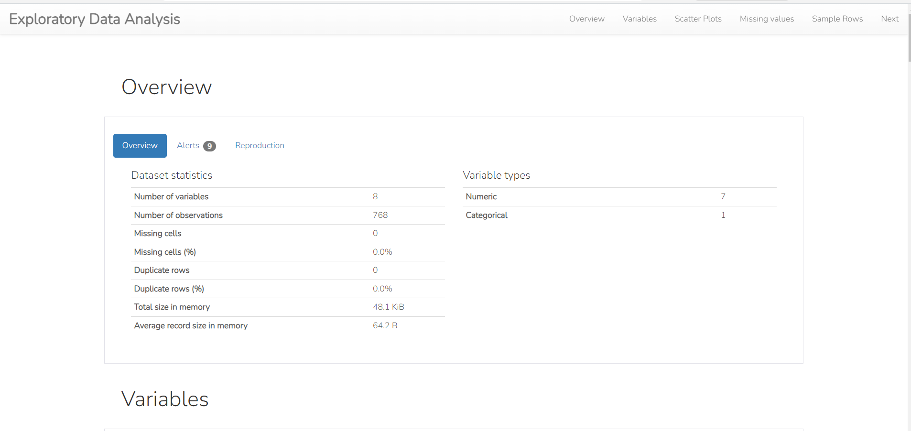
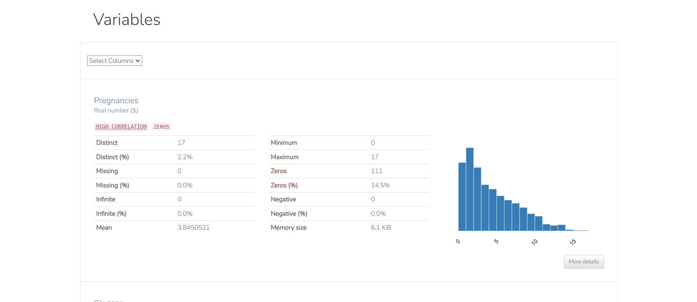
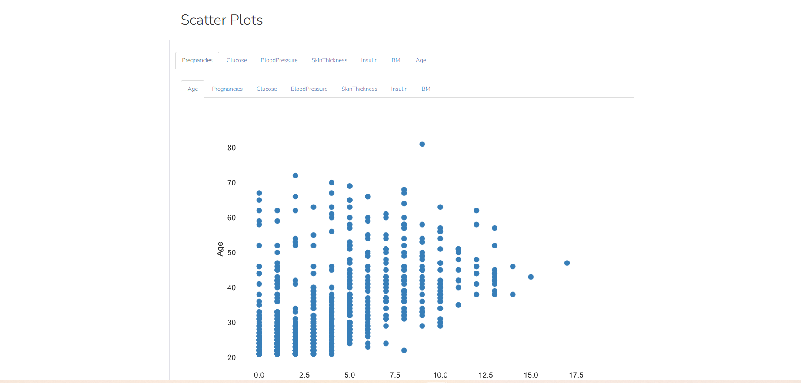
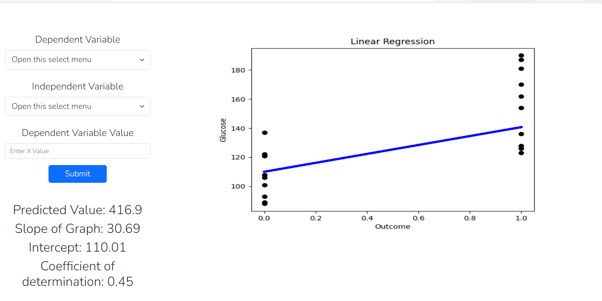

# Exploratory Data Analysis, Data Visualization and Prediction Web Application
This is a Web Application for Exploratory Data Analysis (EDA), Data Visualization and Prediction of a CSV file.

### How it works:
1. Upload the CSV file
2. Click on `Submit` button
3. You will see the complete Data Analysis, Visualization and Prediction in an interactive web page
<!-- Input: CSV file  
Output: Complete Data Analysis such as mean, Meidan, IQR etc, Visualization using Scatter plots, Clustering etc. and Prediction using Linear Regression.   -->

### Tech Stack: 
1. Python
2. Pandas
3. Numpy
4. Matplotlib
5. Scikit-learn
6. Flask
7. HTML & CSS
8. Bootstrap
9. JavaScript

### How to run the application:
1. Clone the repository
2. Install the dependencies using `pip install -r requirements.txt`
3. Run the application using `python main.py`
4. Open the browser and go to `http://127.0.0.1:8080/`
5. Upload the CSV file and click on `Submit` button
6. You will see the complete Data Analysis, Visualization and Prediction

### Screenshots:

